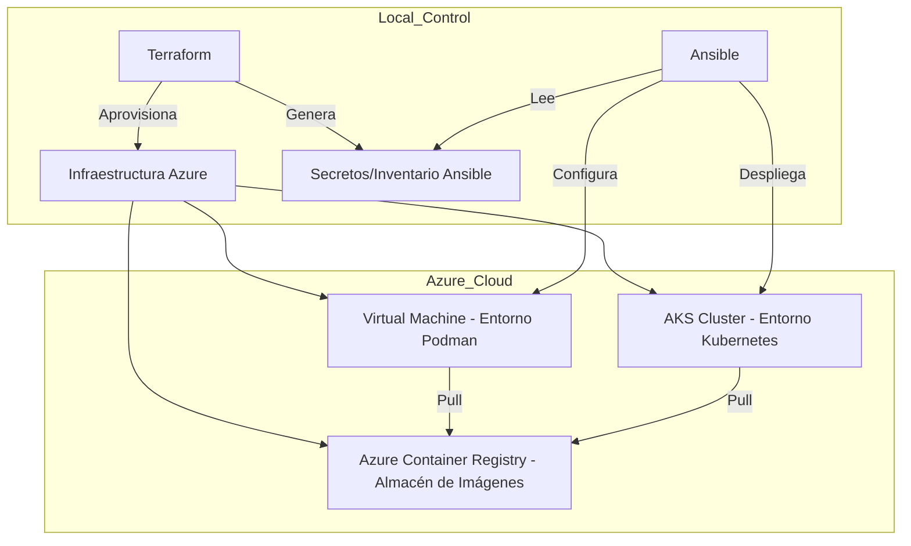

**DOCUMENTACIÓN TÉCNICA**

Caso Práctico 2 — CP2

**DevOps & Cloud**

Automatización de Despliegues en Azure

**Herramientas utilizadas:**

Terraform  ·  Ansible  ·  Azure  ·  Kubernetes  ·  Podman

# **1\. Introducción**

El caso práctico 2 consiste en desplegar dos aplicaciones levantando previamente la infraestructura en Azure sobre la cual van a funcionar. Para ello se van a utilizar las siguientes herramientas:

* Terraform 

* Ansible 

* Azure 

* Podman 

El resultado es una ejecución automatizada sin intervención manual en cada fase del ciclo de vida de la infraestructura, desde la creación del grupo de recursos hasta la exposición de la aplicación web al exterior mediante un LoadBalancer en AKS.

## **1.1 Repositorio del Proyecto**

El código fuente completo está disponible en el siguiente repositorio:
**URL:** [https://github.com/jaumeguimera/devopsunircp2](https://github.com/jaumeguimera/devopsunircp2)

## **1.2 Arquitectura de Despliegue**

A continuación se muestra el flujo de trabajo y la relación entre los distintos componentes del proyecto:

## **1.3 Descripción de las Aplicaciones**

Se despliegan dos soluciones diferenciadas sobre distintos entornos de Azure:

### **1.3.1 Modern Weather & Time App (VM — Podman)**
Aplicación web moderna que muestra información meteorológica y horaria en tiempo real con una interfaz estética basada en **Glassmorphism**. Se ejecuta como un contenedor único en la VM de Azure para simular un despliegue de microservicio aislado o entorno legacy migrado a contenedores.

### **1.3.2 Azure Vote App (AKS — Kubernetes)**
Plataforma de votación distribuida que utiliza un stack de dos niveles:
*   **Frontend**: Interfaz web desarrollada en Python/Flask que permite realizar votos. Se comunica con el backend mediante el nombre DNS interno de Kubernetes.
*   **Backend (Redis)**: Motor de almacenamiento en memoria para persistir los votos. Se ha configurado con **Persistencia de Datos** mediante un Volumen (PVC) sobre Azure Managed Disks para evitar la pérdida de información en caso de reinicio de los pods.

# **2\. Infraestructura**

Para el caso práctico vamos a crear los siguientes recursos:

| Tipo | Componente Azure | Responsabilidad |
| ----- | ----- | ----- |
| Almacenamiento | Azure Container Registry (ACR) | Registro de imágenes de las apps a desplegar |
| Despliegue VM | Azure Linux Virtual Machine | Servidor web Ubuntu con Podman  |
| Orquestación | Azure Kubernetes Service (AKS) | Clúster creado para la Azure Vote App con almacenamiento persistente. |

# **3\. Documentación de Terraform**

Terraform gestiona la fase de aprovisionamiento. A continuación se detalla cada archivo de configuración con explicación línea a línea.

## **3.1 main.tf**

Punto de entrada de la configuración. Define los proveedores necesarios, el grupo de recursos y las variables locales.

terraform {  
  required\_providers {  
    azurerm \= {  
      source  \= "hashicorp/azurerm"  
      version \= "\>=4.62.1"  
    }  
    random \= {  
      source  \= "hashicorp/random"  
      version \= "\>=3.8.1"  
    }  
  }  
}  
   
provider "azurerm" {  
  features {}  
}  
   
resource "azurerm\_resource\_group" "rg" {  
  name     \= var.resource\_group\_name  
  location \= var.location  
  tags     \= { environment \= local.tag\_name }  
}  
   
locals {  
  tag\_name \= "casopractico2"  
}  
   
resource "random\_string" "suffix" {  
  length  \= 5  
  upper   \= false  
  special \= false  
}

| Elemento | Descripción |
| ----- | ----- |
| required\_providers | Declara las dependencias de proveedores con versiones mínimas garantizadas. |
| provider "azurerm" | Configura el proveedor de Azure Resource Manager. El bloque features {} es obligatorio aunque esté vacío. |
| azurerm\_resource\_group | Crea el contenedor lógico de todos los recursos del proyecto. Parámetros obtenidos de variables. |
| locals.tag\_name | Constante interna que actúa como sufijo de nomenclatura y valor del tag "environment" en todos los recursos. |
| random\_string.suffix | Genera 5 caracteres alfanuméricos en minúscula para garantizar unicidad global en el nombre del ACR. |

## **3.2 variables.tf**

Define las variables de entrada con sus tipos y valores por defecto. Permiten parametrizar el despliegue sin modificar el código.

variable "resource\_group\_name" {  
  type    \= string  
  default \= "rg-casopractico2"  
}  
   
variable "location" {  
  type    \= string  
  default \= "swedencentral"  
}  
   
variable "admin\_username" {  
  type    \= string  
  default \= "azureuser"  
}

| Variable | Valor por defecto | Uso |
| ----- | ----- | ----- |
| resource\_group\_name | rg-casopractico2 | Nombre del grupo de recursos en Azure. |
| location | swedencentral | Región de Azure donde se aprovisiona toda la infraestructura. |
| admin\_username | azureuser | Usuario administrador de la VM Linux. Se usa también en la configuración de la clave SSH. |

## **3.3 acr.tf**

Crea el Azure Container Registry privado que actúa como repositorio central de imágenes del proyecto.

resource "azurerm\_container\_registry" "acr" {  
  name                \= "acr${local.tag\_name}${random\_string.suffix.result}"  
  resource\_group\_name \= azurerm\_resource\_group.rg.name  
  location            \= azurerm\_resource\_group.rg.location  
  sku                 \= "Basic"  
  admin\_enabled       \= true  
  tags                \= { environment \= "${local.tag\_name}" }  
}

| Nota sobre el nombre del ACR El nombre del ACR debe ser globalmente único en Azure. Para lograrlo, se concatena el tag del proyecto ("casopractico2") con el sufijo aleatorio generado por random\_string. El resultado es algo como: "acrcasopractico2ab3xy" El flag admin\_enabled \= true permite autenticar Podman/Docker con usuario y contraseña, las cuales Terraform exporta automáticamente a secrets.yml mediante ansible\_vars.tf. |
| :---- |

## **3.4 aks.tf**

Aprovisiona el clúster de Kubernetes gestionado (AKS) y configura la integración con el ACR mediante RBAC.

resource "azurerm\_kubernetes\_cluster" "aks" {  
  name                \= "aks-${local.tag\_name}"  
  location            \= azurerm\_resource\_group.rg.location  
  resource\_group\_name \= azurerm\_resource\_group.rg.name  
  dns\_prefix          \= "aks${local.tag\_name}"  
   
  default\_node\_pool {  
    name       \= "default"  
    node\_count \= 1  
    vm\_size    \= "standard\_d2s\_v3"  
  }  
   
  identity {  
    type \= "SystemAssigned"  
  }  
   
  tags \= { environment \= "${local.tag\_name}" }  
}  
   
resource "azurerm\_role\_assignment" "ra-perm" {  
  principal\_id         \= azurerm\_kubernetes\_cluster.aks.kubelet\_identity\[0\].object\_id  
  role\_definition\_name \= "AcrPull"  
  scope                \= azurerm\_container\_registry.acr.id  
}

| Elemento | Descripción |
| ----- | ----- |
| dns\_prefix | Prefijo del FQDN del API server de Kubernetes. Debe ser único dentro de la región. |
| node\_count \= 1 | Un solo nodo worker. Configuración mínima adecuada para un entorno de laboratorio. |
| identity.SystemAssigned | El clúster obtiene su propia identidad gestionada en Azure AD, eliminando la necesidad de gestionar Service Principals manualmente. |
| azurerm\_role\_assignment | Asigna el rol AcrPull a la identidad kubelet del clúster sobre el scope del ACR. Esto permite que los nodos descarguen imágenes sin credenciales adicionales. |

## **3.5 vm.tf**

Define toda la infraestructura de red (VNet, Subnet, NSG, IP pública) y la máquina virtual Linux.

\# Virtual Network  
resource "azurerm\_virtual\_network" "vnet" {  
  name          \= "vnet-${local.tag\_name}"  
  address\_space \= \["10.0.0.0/16"\]  
  ...  
}  
   
\# Subnet  
resource "azurerm\_subnet" "snet" {  
  address\_prefixes \= \["10.0.1.0/24"\]  
  ...  
}  
   
\# Network Security Group (permite SSH:22 y HTTP:80)  
resource "azurerm\_network\_security\_group" "nsg" {  
  security\_rule { name \= "ssh",  priority \= 101, destination\_port\_range \= "22" }  
  security\_rule { name \= "http", priority \= 102, destination\_port\_range \= "80" }  
}  
   
\# IP Pública estática con etiqueta DNS personalizada  
resource "azurerm\_public\_ip" "pip" {  
  allocation\_method \= "Static"  
  domain\_name\_label \= "jgm-unir-${local.tag\_name}"  
}  
   
\# Máquina Virtual Linux (Ubuntu 22.04 LTS)  
resource "azurerm\_linux\_virtual\_machine" "vm1" {  
  size           \= "Standard\_B2als\_v2"  
  admin\_username \= var.admin\_username  
  admin\_ssh\_key  { public\_key \= tls\_private\_key.ssh\_key.public\_key\_openssh }  
  source\_image\_reference {  
    publisher \= "Canonical"  
    offer     \= "0001-com-ubuntu-server-jammy"  
    sku       \= "22\_04-lts"  
  }  
}

| Recurso | Descripción |
| ----- | ----- |
| azurerm\_virtual\_network | Red privada con espacio de direcciones 10.0.0.0/16. Contiene todos los recursos de cómputo del proyecto. |
| azurerm\_subnet | Subred 10.0.1.0/24 dentro de la VNet. La VM obtiene una IP privada de este rango. |
| azurerm\_network\_security\_group | Firewall de nivel NIC. Permite SSH (22) para gestión remota y HTTP (80) para acceso a la aplicación web. |
| azurerm\_public\_ip | IP estática con FQDN personalizado (jgm-unir-casopractico2.\*). Garantiza que la IP no cambia entre reinicios. |
| azurerm\_linux\_virtual\_machine | VM Ubuntu 22.04 LTS. La autenticación es exclusivamente por clave SSH (sin contraseña) generada por tls\_private\_key. |

## **3.6 ansible\_vars.tf**

Genera automáticamente el archivo de variables secretas para Ansible como output del proceso de aprovisionamiento.

resource "local\_file" "ansible\_secrets" {  
  content \= yamlencode({  
    acr\_login\_server \= azurerm\_container\_registry.acr.login\_server  
    acr\_user         \= azurerm\_container\_registry.acr.admin\_username  
    acr\_name         \= azurerm\_container\_registry.acr.admin\_username  
    acr\_password     \= azurerm\_container\_registry.acr.admin\_password  
  })  
  filename \= "${path.module}/../ansible/vars/secrets.yml"  
}

Este archivo es fundamental para el desacoplamiento Terraform-Ansible: Terraform conoce las credenciales porque las aprovisiona, y las exporta al filesystem en formato YAML para que Ansible las consuma en tiempo de ejecución del playbook. Esto evita hardcodear secretos en el repositorio.

## **3.7 inventory.tf e inventory.tpl**

Genera dinámicamente el inventario de Ansible con las IPs y datos de conexión producidos por Terraform.

\# inventory.tf  
resource "local\_file" "ansible\_inventory" {  
  content \= templatefile("${path.module}/inventory.tpl", {  
    vm\_ip         \= azurerm\_public\_ip.pip.ip\_address  
    admin\_user    \= var.admin\_username  
    ssh\_key\_path  \= local\_sensitive\_file.ssh\_private\_key.filename  
    aks\_host      \= azurerm\_kubernetes\_cluster.aks.fqdn  
  })  
  filename \= "${path.module}/../ansible/inventory/hosts.ini"  
}  
   
\# inventory.tpl  
\[azure\_vm\]  
${vm\_ip} ansible\_user=${admin\_user} ansible\_ssh\_private\_key\_file=${ssh\_key\_path}  
   
\[aks\]  
localhost ansible\_connection=local

| Por qué es crítico el inventory.tf Tras cada ciclo terraform destroy \+ terraform apply, la IP pública y el FQDN del AKS cambian. Sin la generación automática del inventario, Ansible intentaría conectarse a IPs obsoletas, causando errores de conexión SSH y kubeconfig inválidos. El uso de templatefile() garantiza que el inventario siempre refleja el estado actual de la infraestructura. |
| :---- |

## **3.8 Archivo de Secretos (secrets.yml)**

Este archivo se genera automáticamente en la ruta `ansible/vars/secrets.yml` una vez que Terraform se ha ejecutado correctamente (`terraform apply`). Su creación es fundamental ya que contiene las variables y credenciales del Azure Container Registry (ACR) que Ansible necesita obligatoriamente para las tareas de login, pull y push de imágenes durante la fase de configuración.

Al contener información sensible, este archivo está configurado en el `.gitignore` para no ser persistido en el control de versiones.

## **3.9 outputs.tf**

Define los valores que Terraform expone tras un despliegue exitoso. Útiles para la gestión y conexión manual.

| Output | Descripción |
| ----- | ----- |
| resource\_group\_name | Nombre del Resource Group creado. |
| public\_ip\_address | Dirección IP pública estática asignada a la VM. |
| admin\_username | Usuario administrador configurado para el acceso SSH a la VM. |

# **4\. Documentación de Ansible**

Ansible gestiona la fase de configuración y despliegue. El playbook principal orquesta tres roles en secuencia: ACR, VM y AKS.

## **4.1 playbook.yml**

El playbook raíz define tres plays independientes con targets, privilegios y variables diferentes.

\---  
\- name: ACR AKS  
  hosts: localhost  
  vars\_files: vars/secrets.yml  
  tasks:  
    \- name: Role ACR  
      include\_role:  
        name: acr  
   
\- name: Virtual Machine  
  hosts: azure\_vm  
  tags: create\_vm  
  vars\_files: vars/secrets.yml  
  become: true  
  tasks:  
    \- name: Role VM  
      include\_role:  
        name: vm  
   
\- name: Deployment on AKS  
  hosts: aks  
  vars\_files: vars/secrets.yml  
  tasks:  
    \- name: Role AKS  
      include\_role:  
        name: aks

| Play | Host target | become | Responsabilidad |
| ----- | ----- | ----- | ----- |
| ACR AKS | localhost | No | Gestión de imágenes: login en ACR, pull de imágenes públicas y push al registro privado. |
| Virtual Machine | azure\_vm | Sí (sudo) | Configuración del SO: apt update, instalación de Podman, arranque del contenedor. |
| Deployment on AKS | aks (localhost) | No | Despliegue en K8s: obtención de kubeconfig, namespace, PVC, deployments y Service. |

## **4.2 Rol ACR — tasks/main.yml**

Gestiona el ciclo de vida de las imágenes de contenedor: autenticación en el registro privado, descarga de imágenes públicas y publicación en el ACR.

\- name: Login Podman to ACR  
  containers.podman.podman\_login:  
    registry: "{{ acr\_user }}.azurecr.io"  
    username: "{{ acr\_user }}"  
    password: "{{ acr\_password }}"  
   
\- name: Pull and push frontend image for k8s  
  containers.podman.podman\_image:  
    name: docker.io/jsosa15/azure-vote-front  
    tag: v1  
    push: true  
    push\_args:  
      dest: "{{ acr\_name }}.azurecr.io/azure-vote-front:casopractico2"  
   
\- name: Pull and push redis backend image for k8n  
  containers.podman.podman\_image:  
    name: docker.io/jsosa15/redis  
    tag: 6.0.8  
    push: true  
    push\_args:  
      dest: "{{ acr\_name }}.azurecr.io/redis:casopractico2"  
   
\- name: Pull the source image (ttt-app)  
  containers.podman.podman\_image:  
    name: docker.io/jguimeradev/ttt-app  
    tag: v1  
    push: true  
    push\_args:  
      dest: "{{ acr\_name }}.azurecr.io/ttt-app:casopractico2"

| Consideraciones sobre autenticación Podman \+ ACR Podman almacena las credenciales de autenticación en \~/.config/containers/auth.json, mientras que "az acr login" escribe en \~/.docker/config.json. Si ambos archivos coexisten con tokens distintos, Podman puede fallar al resolver la credencial correcta. Para evitar conflictos: usar exclusivamente podman\_login del módulo containers.podman y no mezclar con "az acr login" en el mismo contexto de ejecución. |
| :---- |

## **4.3 Rol VM — tasks/main.yml**

Configura la máquina virtual Ubuntu: actualización del sistema, instalación del motor de contenedores Podman y despliegue de la aplicación web.

\- name: update and upgrade system  
  ansible.builtin.apt:  
    upgrade: dist  
    update\_cache: yes  
   
\- name: install podman  
  ansible.builtin.apt:  
    name: podman  
    state: latest  
   
\- name: Login Podman to ACR  
  containers.podman.podman\_login:  
    registry: "{{ acr\_user }}.azurecr.io"  
    username: "{{ acr\_user }}"  
    password: "{{ acr\_password }}"  
   
\- name: Pull an image from Azure Registry  
  containers.podman.podman\_image:  
    name: "{{ acr\_name }}.azurecr.io/ttt-app:casopractico2"  
   
\- name: Run app container  
  containers.podman.podman\_container:  
    name: ttt-app  
    image: "{{ acr\_name }}.azurecr.io/ttt-app:casopractico2"  
    state: started  
    ports: "80:80"

\- name: Reload systemd  
  systemd:  
    daemon\_reload: yes  
   
\- name: Verify container status  
  command: podman ps  
  register: podman\_output

| Tarea | Descripción |
| ----- | ----- |
| apt upgrade: dist | Actualización completa del sistema operativo incluyendo el kernel. Requiere become: true (definido en el play). |
| apt install podman | Instala la última versión disponible de Podman desde los repositorios de Ubuntu. Podman es daemonless, no requiere servicio systemd. |
| podman\_container started | Inicia el contenedor ttt-app mapeando el puerto 80 del host al 80 del contenedor. La imagen se descarga del ACR privado. |

## **4.4 Rol AKS — tasks/main.yml**

El rol más complejo: obtiene el kubeconfig de Azure, y despliega todos los recursos Kubernetes necesarios para la aplicación Azure Vote.

### **4.4.1 Obtención del Kubeconfig**

\- name: Get AKS credentials block  
  block:  
    \- name: Fetch AKS cluster details  
      azure.azcollection.azure\_rm\_aks\_info:  
        resource\_group: "rg-casopractico2"  
        name: "aks-casopractico2"  
        show\_kubeconfig: user  
      register: aks\_info  
   
    \- name: Write kubeconfig content  
      ansible.builtin.copy:  
        content: "{{ aks\_info.aks\[0\].kube\_config\[0\] }}"  
        dest: "\~/.kube/config"  
        mode: "0600"

| Acceso correcto al kubeconfig El módulo azure\_rm\_aks\_info devuelve una lista de objetos. La ruta correcta al contenido del kubeconfig es: aks\_info.aks\[0\].kube\_config\[0\] El modo 0600 es obligatorio: kubectl rechaza archivos de configuración con permisos demasiado permisivos por razones de seguridad. |
| :---- |

### **4.4.2 Namespace y Almacenamiento Persistente**

\- name: Create Namespace  
  kubernetes.core.k8s:  
    state: present  
    definition:  
      apiVersion: v1  
      kind: Namespace  
      metadata:  
        name: "{{ namespace\_name }}"  
   
\- name: Create persistence (PVC)  
  kubernetes.core.k8s:  
    state: present  
    definition:  
      apiVersion: v1  
      kind: PersistentVolumeClaim  
      metadata:  
        name: backend-pvc  
        namespace: "{{ namespace\_name }}"  
      spec:  
        accessModes: \[ReadWriteOnce\]  
        resources:  
          requests:  
            storage: 1Gi

El PVC de 1Gi se provisiona automáticamente usando Azure Managed Disks gracias al StorageClass por defecto de AKS (azure-disk). Este disco persiste los datos de Redis incluso si el pod es eliminado o reiniciado.

### **4.4.3 Deployments y Servicio**

\# Backend: Redis con almacenamiento persistente  
\- name: Backend deployment  
  kubernetes.core.k8s:  
    definition:  
      kind: Deployment  
      metadata:  
        name: azure-vote-back  
      spec:  
        replicas: 1  
        containers:  
          \- name: redis  
            image: "{{ backend\_image }}"  
            ports: \[containerPort: 6379\]  
            volumeMounts:  
              \- name: redis-data  
                mountPath: /data  
        volumes:  
          \- name: redis-data  
            persistentVolumeClaim:  
              claimName: backend-pvc  
   
\# Expose Redis with ClusterIP  
\- name: Expose Redis with ClusterIP  
  kubernetes.core.k8s:  
    definition:  
      kind: Service  
      metadata:  
        name: azure-vote-back  
      spec:  
        type: ClusterIP  
        selector:  
          app: azure-vote-back  
        ports:  
          \- port: 6379  
   
\# Frontend: Azure Vote App  
\- name: Frontend deployment  
  kubernetes.core.k8s:  
    definition:  
      kind: Deployment  
      metadata:  
        name: azure-vote-front  
      spec:  
        containers:  
          \- name: azure-vote-front  
            image: "{{ frontend\_image }}"  
            ports: \[containerPort: 80\]  
            env:  
              \- name: REDIS  
                value: "azure-vote-back"  
   
\# Servicio LoadBalancer (expone al exterior)  
\- name: Create LoadBalancer Service  
  kubernetes.core.k8s:  
    definition:  
      kind: Service  
      metadata:  
        name: azure-vote-front  
      spec:  
        type: LoadBalancer  
        selector:  
          app: azure-vote-front  
        ports:  
          \- port: 80

| Recurso K8s | Tipo | Descripción |
| ----- | ----- | ----- |
| azure-vote-back | Deployment | Redis 1 réplica. Monta el PVC en /data para persistencia de votos. |
| azure-vote-front | Deployment | App web 1 réplica. Se conecta al backend via variable de entorno REDIS=azure-vote-back. |
| backend-pvc | PVC | Azure Managed Disk de 1Gi. Modo ReadWriteOnce compatible con un solo nodo. |
| azure-vote-front | Service LB | Azure asigna una IP pública externa. Puerto 80 → pod frontend puerto 80\. |

# **5\. Proceso de Despliegue, Requisitos y Recursos**

### **5.1. Requisitos Previos**
- **Azure CLI**: Autenticado mediante `az login`.
- **Terraform (v1.0+)**: Para el aprovisionamiento.
- **Ansible (v2.10+)**: Con las colecciones `kubernetes.core` y `containers.podman`.
- **Llave SSH**: Generada automáticamente por Terraform para el acceso a la VM.

### **5.2. Proceso de Ejecución**
1. **Fase de Infraestructura**: `terraform apply`. Crea el Resource Group, Redes, VM, ACR y AKS. Genera el archivo de variables para Ansible.
2. **Fase de Configuración**: `ansible-playbook playbook.yml`.
   - Prepara la VM e instala Podman.
   - Autentica contra ACR y levanta la aplicación en la VM.
   - Conecta con AKS, crea el namespace y despliega el stack de Kubernetes.

### **5.3. Recursos Resultantes en Azure**
- **1 Resource Group**: Contenedor lógico.
- **1 Virtual Network & Subnet**: Red aislada para la VM.
- **1 Public IP & NSG**: Acceso externo controlado.
- **1 Azure Container Registry**: SKU Basic.
- **1 AKS Cluster**: 1 Nodo System (Standard\_D2s\_v3).
- **1 Azure Managed Disk**: Creado dinámicamente mediante el PVC de Redis.

# **6\. Problemas Conocidos y Soluciones**

Durante el desarrollo del proyecto se identificaron y resolvieron los siguientes problemas recurrentes:

| Problema | Solución aplicada |
| ----- | ----- |
| Podman no puede autenticarse en el ACR aunque az acr login haya tenido éxito. | az acr login escribe en \~/.docker/config.json pero Podman usa \~/.config/containers/auth.json. Usar siempre containers.podman.podman\_login en el playbook, nunca az acr login para sesiones de Ansible. |
| Tras terraform destroy \+ apply, Ansible falla con "Host key verification failed" o kubeconfig inválido. | El FQDN del AKS y la IP de la VM cambian en cada ciclo. El inventory.tf con templatefile() regenera automáticamente hosts.ini. Además, resetear known\_hosts antes de re-ejecutar Ansible. |
| Error "ModuleNotFoundError: No module named azure" en las tareas del rol AKS. | Las librerías Python de Azure y Kubernetes deben instalarse en el venv de pipx donde reside Ansible: python \-m pip install azure-mgmt-containerservice kubernetes dentro del venv correcto. |
| ansible\_python\_interpreter apunta al Python del sistema en vez del venv de pipx. | Definir ansible\_python\_interpreter por play o por host en el inventario, NO globalmente en ansible.cfg. El play de localhost usa el Python del venv; el play de azure\_vm usa /usr/bin/python3 del SO remoto. |
| La ruta al kubeconfig extraído de azure\_rm\_aks\_info es incorrecta o vacía. | La ruta correcta es aks\_info.aks\[0\].kube\_config\[0\]. El módulo devuelve una lista de clusters y cada cluster contiene una lista de configuraciones kubeconfig. |

# **7\. Resumen y Conclusiones**

El Caso Práctico 2 demuestra la implementación de un pipeline de infraestructura como código completo y reproducible. Las principales características del diseño son:

* Separación de responsabilidades clara: Terraform para estado deseado de la infraestructura, Ansible para el estado deseado de la configuración y las aplicaciones.

* Seguridad por diseño: autenticación SSH sin contraseña, identidades gestionadas en AKS, RBAC mínimo (AcrPull), secretos generados dinámicamente y nunca commiteados.

* Idempotencia: tanto los recursos de Terraform como las tareas de Ansible son idempotentes; se pueden re-ejecutar sin efectos secundarios no deseados.

* Desacoplamiento: el archivo secrets.yml y el inventario dinámico actúan como contrato entre Terraform y Ansible, eliminando dependencias directas entre herramientas.

* Almacenamiento persistente: el uso de PVC sobre Azure Managed Disks garantiza que los datos de Redis sobreviven al ciclo de vida de los pods.

La arquitectura resultante es fácilmente extensible: añadir nuevos servicios al AKS, incorporar un pipeline de CI/CD, o añadir monitorización con Azure Monitor son pasos naturales sobre esta base.

# **8\. Licencia**

Este proyecto se distribuye bajo la **Licencia MIT**.

### **8.1. Restricciones y Permisos**
- **Permisos**: Permite el uso comercial, la modificación, la distribución y el uso privado.
- **Restricciones**: La única condición es que se debe incluir el aviso de copyright original y el texto de la licencia en todas las copias o partes sustanciales del software.
- **Garantía**: El software se proporciona "tal cual", sin garantía de ningún tipo.

